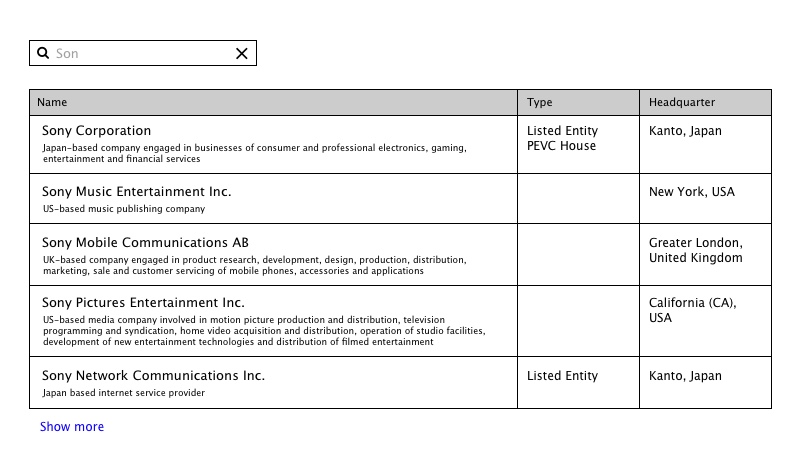

# Acuris React front end test

A React component where a user can type a company name which returns a filtered list of results, in groups of 5.

## Acceptance criteria

- Create an input box where a user can enter the name of a company
- After the input of the 3rd character, render a filtered list of results which match the characters in the user input (there is an example json file with a sample set of results for you to work with)
- When the user removes the text from the search box, no results will be displayed
- When there are 2 characters or less in the search box, no results will be displayed
- Create a clear button which, when clicked, will clear the user input
- The rendered list will display results and associated metadata, as per wireframe
- If there are more than 5 matching items, render a "next page" button – when this button is clicked, the next 5 items should be revealed
- If the user is on the second page, display "prev page" button - when this button is clicked the previous 5 items should be revealed
- "Prev page" button is hidden on the first page, "next page" button is hidden on the last page

## General comments
* The project was initialised with create-react-app, which means all the build scripts are provided by react-scripts.
* React-scripts do not provide support for the css pre-processors out of the box, so plain CSS was used for styling.
* Some elements in the layout have 'data-role' attributes assigned to them. I've used this attribute to access the rendered data from the tests using Enzyme. In future these attributes can be used in automated acceptance tests build for example with Selenium.
* Task description did not mention mobile devices and pixel-perfect layout, so no support for mobile devises is provided and no css normalization.

## Areas of improvement
### UI
* Do not use links for paging or consider adjusting eslint rules for the project, since a 'Script URL is a form of eval  no-script-url' warning is generated in console.
* On page load put focus into filtering input
* Provide special layout for mobile devices
* Use html5 semantic layout elements

### Code and Project setup
* Introduce CSS normalization
* Add automated UI tests with Selenium, for example
* Consider using redux-devtools-extension to support Chrome plugin, which will be very helpful, when project grows.
* Consider using Flow static type annotations
* Consider adding jest snapshot testing.
* Consider changing the way files are imported, right now project uses relative paths with a lot of jumping from directory to directory: "../components/CompanyList". As the project grows, handling more and more complex paths for file inclusion will become tedious. It would be nicer to use imports relative to the main package: ‘/components/CompanyList’. 

## Available Scripts

In the project directory, you can run:

### `npm start`

Runs the app in the development mode. 
Open [http://localhost:3000](http://localhost:3000) to view it in the browser.

The page will reload if you make edits. 
You will also see any lint errors in the console.

### `npm test`

Launches the test runner in the interactive watch mode. 
See the section about [running tests](#running-tests) for more information.

### `npm run build`

Builds the app for production to the `build` folder. 
It correctly bundles React in production mode and optimizes the build for the best performance.

The build is minified and the filenames include the hashes. 
Your app is ready to be deployed!

See the section about [deployment](#deployment) for more information.

### `npm run eject`

**Note: this is a one-way operation. Once you `eject`, you can’t go back!**

If you aren’t satisfied with the build tool and configuration choices, you can `eject` at any time. This command will remove the single build dependency from your project.

Instead, it will copy all the configuration files and the transitive dependencies (Webpack, Babel, ESLint, etc) right into your project so you have full control over them. All of the commands except `eject` will still work, but they will point to the copied scripts so you can tweak them. At this point you’re on your own.

You don’t have to ever use `eject`. The curated feature set is suitable for small and middle deployments, and you shouldn’t feel obligated to use this feature. However we understand that this tool wouldn’t be useful if you couldn’t customize it when you are ready for it.
